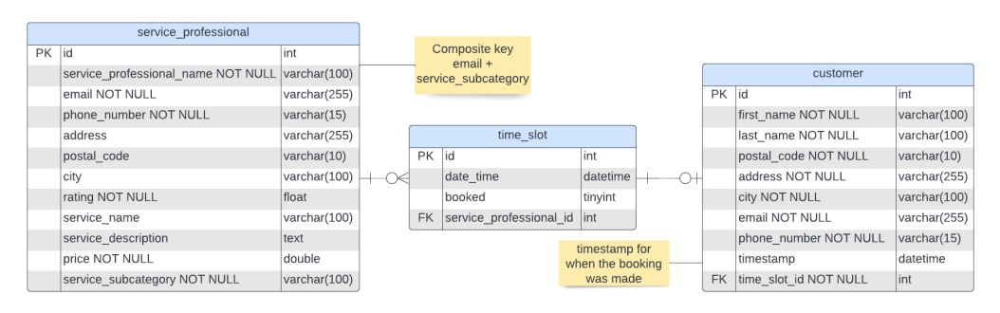

<h1 align="center">Backend RESTful Spring Boot API for database handling</h1>

The backend sends and recieves data to and from an <a href="https://github.com/lehtihet/SnapApp">Android app</a>. This backend was hosted on Heroku along with a MySQL database.

## Features

The database has three tables:

- **Customer, which stores information about a customer and the booking they made. This entry is created when a customer confirms their booking.**
- **Service Professional, which stores information about a service professional including what services they offer and their price.**
- **Time Slot, which contains information of when a service can be booked. Service Professionals can have multiple time slots.**

  

## About

This backend along with the [Android frontend](https://github.com/lehtihet/SnapApp) was developed as a part of [Developing Mobile Applications](https://www.kth.se/student/kurser/kurs/ID2216?l=en) at KTH. 

Many simplifications were made because of the limited time available for this project. In particular, the lack of login functionality for service professionals limited the database design quite significantly. 
